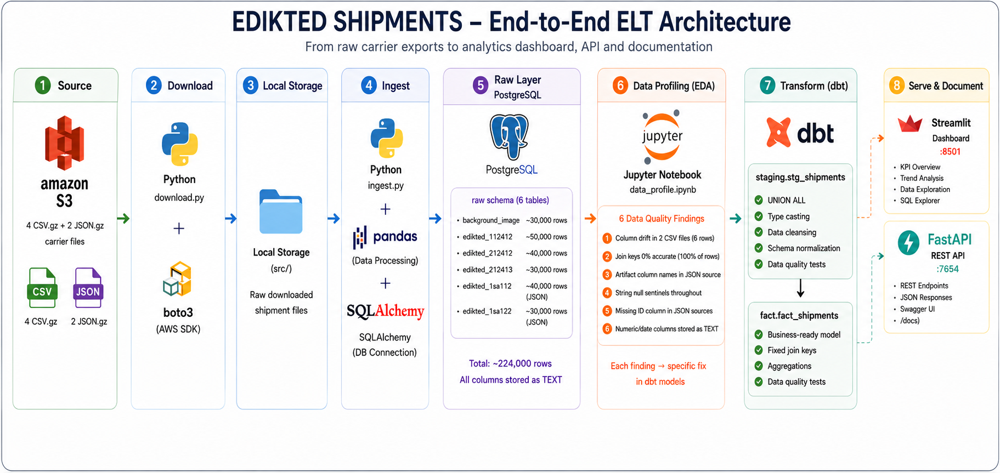
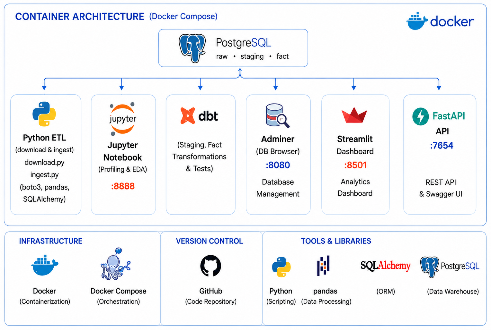
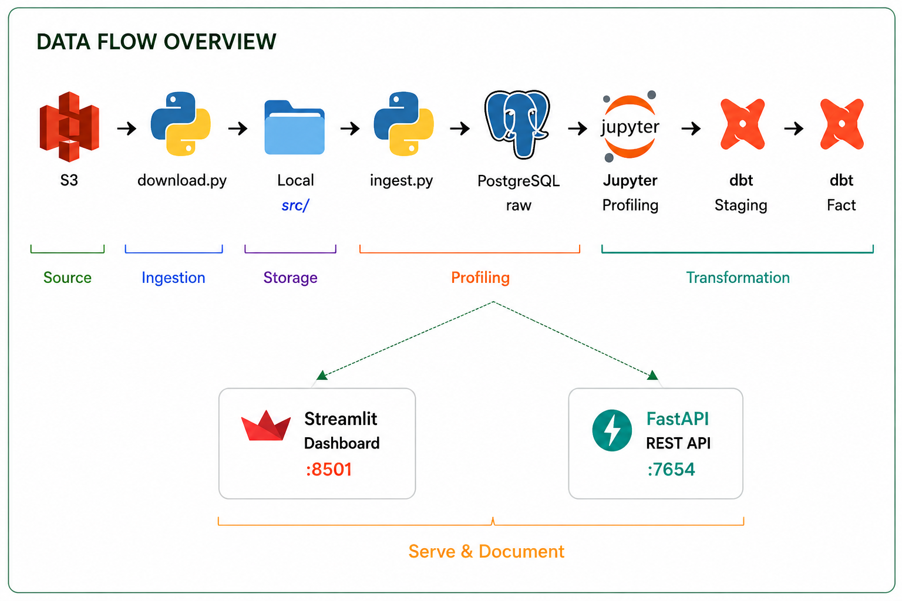
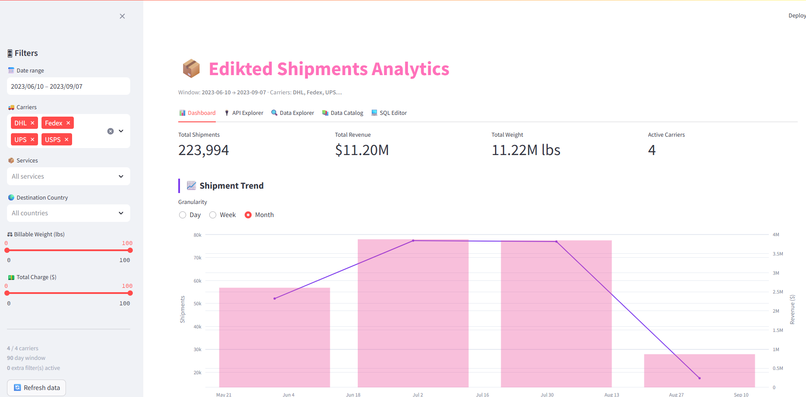
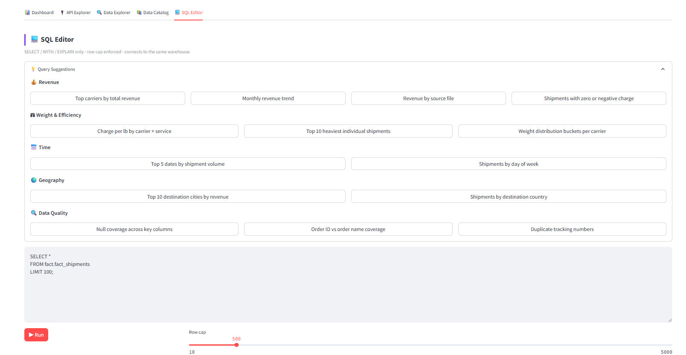
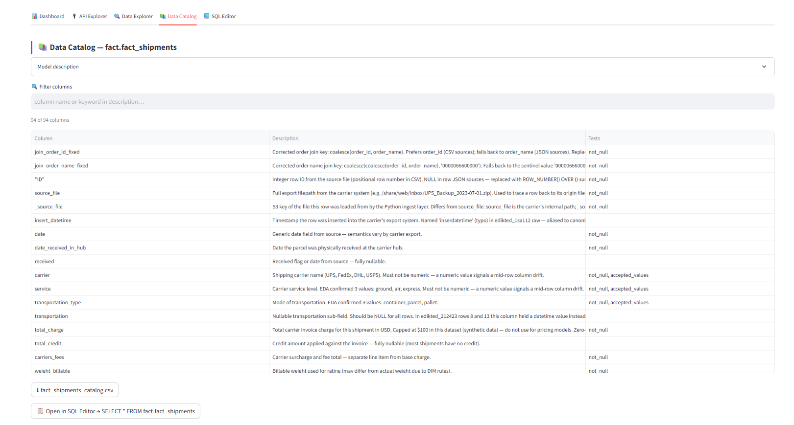
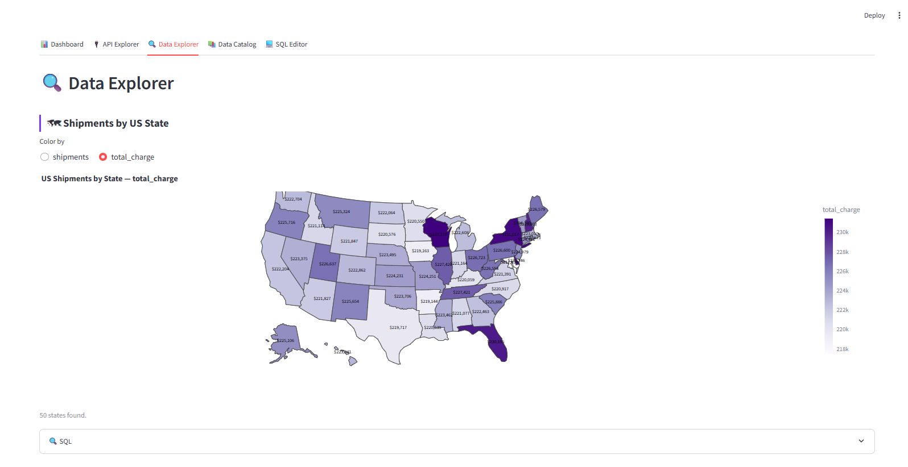
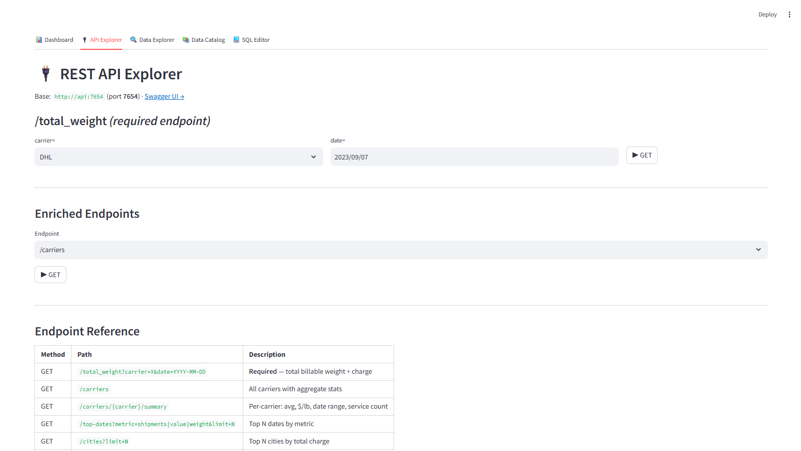

# Edikted Shipments — Data Engineering Assignment

End-to-end ELT pipeline covering **223,994 carrier shipment records** across **4 carriers** (UPS, FedEx, DHL, USPS). Raw carrier exports originate as CSV and Excel files stored in AWS S3, representing real-world fulfillment data with inconsistent schemas, mixed date formats, free-text weight fields, and duplicate order identifiers — the kind of messiness that appears in production logistics systems.

The pipeline loads raw files as-is into PostgreSQL (no transformation on ingest), then uses **dbt** to clean, type-cast, and unify them into a single `fact.fact_shipments` table with 94 documented columns. Data profiling via Jupyter Notebook drove every transformation decision — identifying null patterns, carrier-specific quirks, and the join key ambiguity between order IDs and order names that required a custom fix column.

The processed data is exposed through a **Streamlit analytics dashboard** (KPIs, carrier breakdowns, US state choropleth, SQL editor, data catalog) and a **FastAPI REST layer** with 7 endpoints covering shipment lookup, carrier analytics, revenue aggregation, and geographic distribution.

---

## Architecture

> Click on any diagram to view it in full resolution.

### End-to-End ELT



### Container Architecture & Data Flow

<table width="100%">
<tr>
<td valign="top"></td>
<td valign="top"></td>
</tr>
</table>

---

## Prerequisites

- Docker Desktop (Docker Compose V2)
- Raw source files are included in the repo under `./src/`

Credentials (hardcoded in `docker-compose.yml`) — used by Adminer (`http://localhost:8080`) and any external DB client (e.g. psql, DBeaver):

| Field | Adminer | External client |
|-------|---------|-----------------|
| System | `PostgreSQL` | — |
| Server / Host | `postgres` | `localhost` |
| Port | — | `5432` |
| Username | `postgres` | `postgres` |
| Password | `postgres` | `postgres` |
| Database | `warehouse` | `warehouse` |

> Adminer runs inside Docker — use `postgres` (service name) as the server, not `localhost`.

---

## Running

> **Main pipeline**

```
./src/  →  PostgreSQL raw.*  →  dbt staging  →  dbt fact  →  all services
```

```powershell
# Windows
.\run.ps1

# Mac / Linux
bash run.sh
```

Services started automatically:

| URL | Service |
|-----|---------|
| http://localhost:8501 | Streamlit Dashboard |
| http://localhost:7654/docs | FastAPI REST + Swagger |
| http://localhost:8080 | Adminer (DB browser) |
| http://localhost:8888 | Jupyter (data profiling notebook) |

---

> **Optional — re-pull raw files from S3 into `./src/`**
>
> Only needed to refresh source files from the original S3 bucket.

```powershell
cp .env.example .env
```

Add AWS credentials to `.env`:

```env
AWS_ACCESS_KEY_ID=<your key>
AWS_SECRET_ACCESS_KEY=<your secret>
AWS_DEFAULT_REGION=us-east-1
AWS_S3_BUCKET=ed-di-k-andik-1
AWS_S3_PREFIX=di-ex-1/
```

Then download:

```powershell
docker compose run --rm python python download.py && docker compose rm -f python
```

Files land in `./src/`. Run the main pipeline after.

### Stop everything

```powershell
docker compose down
```

### Rebuild after code changes

```powershell
# Dashboard only
docker compose up --build -d dashboard

# API only
docker compose up --build -d api

# Everything
docker compose up --build -d
```

### Re-run dbt only

```powershell
docker compose run --rm dbt
```

---

## Services & Ports

| Service | Port | URL | Purpose |
|---------|------|-----|---------|
| postgres | 5432 | — | Data warehouse |
| adminer | 8080 | http://localhost:8080 | DB admin UI |
| jupyter | 8888 | http://localhost:8888 | Data profiling notebook |
| api | 7654 | http://localhost:7654/docs | FastAPI REST + Swagger |
| dashboard | 8501 | http://localhost:8501 | Streamlit analytics |

---

## Data Sources

| Source File | Raw Table | Format | Rows |
|-------------|-----------|--------|------|
| background_image.zhtml | `raw.background_image` | CSV | ~30,000 |
| edikted_112412.csv.gz | `raw.edikted_112412` | CSV (gzip) | ~50,000 |
| edikted_212412.csv.gz | `raw.edikted_212412` | CSV (gzip) | ~40,000 |
| edikted_212423.csv.gz | `raw.edikted_212423` | CSV (gzip) | ~34,000 |
| edikted_1sa112.json.gz | `raw.edikted_1sa112` | JSON array (gzip) | ~40,000 |
| edikted_1sa122.json.gz | `raw.edikted_1sa122` | JSON array (gzip) | ~30,000 |
| **Total** | | | **~224,000** |

All files share ~92 columns representing carrier invoices. Columns are heterogeneous across sources — staging reconciles them into a unified schema via UNION ALL. All raw columns loaded as TEXT; types are cast in staging.

---

## Data Profiling Process

Profiling came **before** writing any dbt model. Raw data was loaded into `PostgreSQL raw.*` first, then explored in `notebooks/data_profile.ipynb` (Jupyter, port 8888). Only after all 6 findings were documented and understood did dbt model development begin — each finding maps directly to a fix in staging or fact.

The sequence was: load raw → profile → find issues → design fixes → build dbt models → verify with dbt tests.

### Finding 1 — Column Drift (ERROR, 6 rows)

**What:** 6 rows in `edikted_212412` and `edikted_212423` had values shift one column to the right. The `transportation` column (normally NULL) contained a datetime string, pushing all subsequent values into the wrong column. Carrier name ended up in the numeric `total_charge` column — a clearly wrong type.

**Detection:** `additional_handling_length_girth = ''` — this column is the last before the shift and always holds a text value or NULL. A blank string meant the row came from a drifted source line.

**Fix in staging:** `WHERE COALESCE(additional_handling_length_girth, '') != ''` removes all 6 rows before any column casts. Row count: raw=224,000 → stg=223,994 (delta=6 exactly).

---

### Finding 2 — Broken Join Keys (ERROR, 100% of rows)

**What:** The source included pre-computed `join_order_id` and `join_order_name` columns to link shipments to Shopify orders. Cross-checking against `order_id` and `order_name` revealed 0 matching rows — every single join key was wrong.

**Analysis:** The source formula is unknown. The correct derivation by inspection is:
- CSV sources have `order_id` populated, `order_name` NULL
- JSON sources have `order_name` populated, `order_id` NULL
- Therefore: `join_order_id_fixed = COALESCE(order_id, order_name)`
- And: `join_order_name_fixed = COALESCE(COALESCE(order_id, order_name), '0000066600000')` (fallback sentinel for fully NULL rows)

**Fix in fact:** Two new columns added. Original broken columns retained for lineage. dbt tests assert correctness at build time.

---

### Finding 3 — Artifact Column Names in edikted_1sa112 (ERROR)

**What:** The JSON source `edikted_1sa112` had 3 columns with non-standard names:
- `inserdatetime` (typo) instead of `insert_datetime`
- `_warehouse_invoice` (underscore prefix) instead of `warehouse_invoice`
- `_warehouse_fees` (underscore prefix) instead of `warehouse_fees`

**Fix in staging:** Explicit `COALESCE(inserdatetime, insert_datetime) AS insert_datetime` aliases in the UNION ALL merge so downstream sees consistent column names.

---

### Finding 4 — String Null Representations (WARN, widespread)

**What:** Multiple columns used text strings instead of SQL NULL: `'None'`, `'NaN'`, `'NaT'`, `''`, `'nan'`. These pass NOT NULL checks but poison aggregations and type casts.

**Fix:** `clean_str(col)` macro — a `NULLIF(NULLIF(NULLIF(...), 'None'), 'NaN')` blocklist applied to all text columns in staging. Applied to ~60 columns across all sources.

Why blocklist (not regex allowlist): the correct string values are free-form (names, addresses, tracking numbers) so an allowlist would break valid data. Only the NULL sentinels are well-known.

---

### Finding 5 — Missing Integer ID in JSON Sources (WARN)

**What:** CSV files include an `"ID"` column (row number from the carrier system). JSON files have no equivalent — the column is absent from the JSON schema.

**Fix in staging:** `ROW_NUMBER() OVER () AS "ID"` computed for JSON rows in the UNION ALL, so every row in the unified table has a stable surrogate row ID.

---

### Finding 6 — Numeric and Date Columns Stored as Text (WARN)

**What:** Ingest loads all columns as TEXT (intentional — no schema assumption at raw layer). Columns like `total_charge`, `weight_billable`, `invoice_date`, `order_date` need proper types for aggregations.

**Fix:** Two macros applied in staging:
- `clean_num(col)` — regex allowlist `[^0-9.]` stripped, result cast to `NUMERIC`. Handles currency symbols, commas, spaces in source values.
- `clean_date(col)` — regex allowlist validates YYYY-MM-DD format before `::DATE` cast. Invalid strings become NULL instead of erroring.

Why allowlist here (vs blocklist for strings): the valid character set for numbers and dates is small and known. Anything outside it is noise.

---

## dbt Transformations

```
raw.*  ──►  staging.stg_shipments  ──►  fact.fact_shipments
```

### Macros

| Macro | Purpose |
|-------|---------|
| `clean_str(col)` | NULLIF blocklist for string null sentinels |
| `clean_num(col)` | Strip non-numeric chars, cast to NUMERIC |
| `clean_date(col)` | Validate YYYY-MM-DD regex, cast to DATE |
| `generate_schema_name` | Routes models to correct PG schema (staging/fact) |

### Staging model (`staging.stg_shipments`)

- UNION ALL across all 6 raw tables
- Column drift filter (6 rows removed)
- All string columns: `clean_str`
- All numeric columns: `clean_num`
- All date columns: `clean_date`
- JSON artifact column aliases
- ROW_NUMBER surrogate for missing IDs
- 97 dbt tests: `not_null`, `unique`, `accepted_values`, numeric range, date sanity

### Fact model (`fact.fact_shipments`)

- `SELECT * FROM staging.stg_shipments`
- Adds `join_order_id_fixed` and `join_order_name_fixed`
- dbt tests assert 100% join key correctness

---

## REST API Endpoints

Base URL: `http://localhost:7654`

| Method | Endpoint | Required params | Description |
|--------|----------|----------------|-------------|
| GET | `/total_weight` | `carrier`, `date` (YYYY-MM-DD) | Assignment spec endpoint |
| GET | `/carriers` | — | All carriers with shipment count |
| GET | `/carriers/{carrier}/summary` | — | Metrics for one carrier |
| GET | `/top-dates` | `n` (default 3) | Top N dates by shipments |
| GET | `/cities` | `limit` (default 10) | Top cities by shipment volume |
| GET | `/charge-weight-ratio` | — | $/lb ratio by carrier × service |
| GET | `/health` | — | Service health check |

Swagger UI at `/docs` — interactive, no auth required.

---

## Dashboard — 5 Tabs

| Tab | Content |
|-----|---------|
| **📊 Dashboard** | KPI row, monthly trend, heatmap (day × month), Q1–Q4 analytics |
| **🔌 API Explorer** | Live calls to FastAPI endpoints, formatted responses |
| **🔍 Data Explorer** | Carrier comparison, US state choropleth, treemap, top cities |
| **📚 Data Catalog** | `fact.fact_shipments` column browser — description, tests, CSV export |
| **💻 SQL Editor** | Run ad-hoc SELECT queries with 13 pre-built suggestions |

All tabs share a **global sidebar filter** (date range, carrier, service, country, weight, charge) applied to every query via parameterized SQL.



<table width="100%">
<tr>
<td valign="top" width="50%"></td>
<td valign="top" width="50%"></td>
</tr>
<tr>
<td valign="top" width="50%"></td>
<td valign="top" width="50%"></td>
</tr>
</table>

---

## Repo Structure

```
.
├── .env.example              # Environment variable template
├── docker-compose.yml        # All 8 services
├── init.sql                  # Creates raw/staging/fact schemas
├── run.ps1                   # Runbook Windows (two scenarios)
├── run.sh                    # Runbook Mac/Linux (two scenarios)
│
├── python/
│   ├── download.py           # S3 → ./src/
│   ├── ingest.py             # ./src/ → PostgreSQL raw.*
│   ├── Dockerfile
│   └── requirements.txt
│
├── dbt/
│   ├── models/
│   │   ├── staging/
│   │   │   ├── stg_shipments.sql   # UNION ALL + clean + cast
│   │   │   └── schema.yml          # 92 columns, full docs + tests
│   │   └── fact/
│   │       ├── fact_shipments.sql  # SELECT * + 2 fixed join keys
│   │       └── schema.yml          # Full docs inherited + 2 new cols
│   ├── macros/
│   │   ├── clean_str.sql
│   │   ├── clean_num.sql
│   │   ├── clean_date.sql
│   │   └── generate_schema_name.sql
│   ├── dbt_project.yml
│   ├── profiles.yml
│   └── Dockerfile
│
├── app/
│   ├── api/
│   │   ├── main.py           # FastAPI — 7 endpoints
│   │   ├── Dockerfile
│   │   └── requirements.txt
│   └── dashboard/
│       ├── app.py            # Streamlit — 5 tabs, ~1200 lines
│       ├── Dockerfile
│       └── requirements.txt
│
├── notebooks/
│   └── data_profile.ipynb    # EDA — 6 findings with evidence
│
└── src/                      # Raw source files (6 carrier exports)
```
